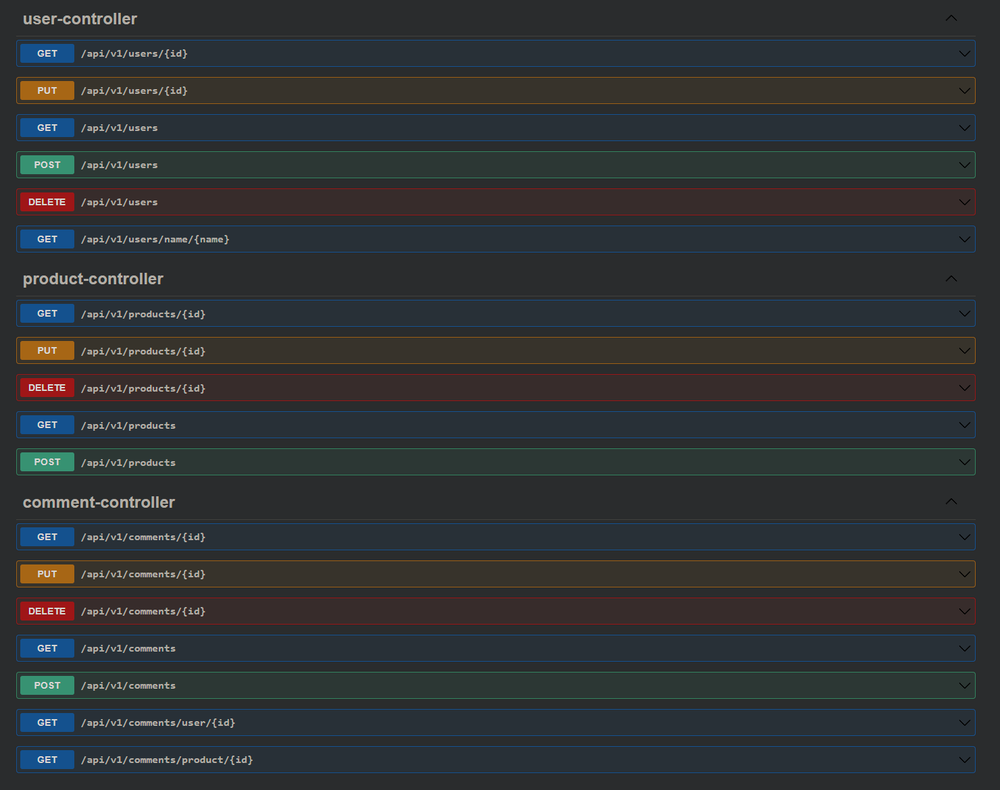

# homework 2

## Teknolojiler

- Java 17
- Spring Boot
- PostgreSQL
- Spring Data JPA
- OpenAPI
---
## Run It On Your Computer

### Project Setup With Maven

Projeyi klonlayın
```bash
  git clone https://github.com/Akbank-Patika-dev-Java-Spring-Bootcamp/homework-2-Mduzgunn.git
```

Proje dizinine gidin
```bash
  cd homework-2-Mduzgunn
```

Gerekli paketleri yükleyin
```bash
  mvn clean install
```

Projeyi çalıştırın
```bash
  mvn spring-boot:run
```

---

## Images

http://localhost:8080/swagger adresinden swagger'ı kullanabilirsiniz.


